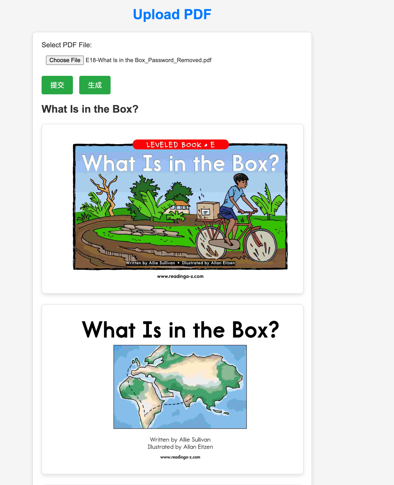
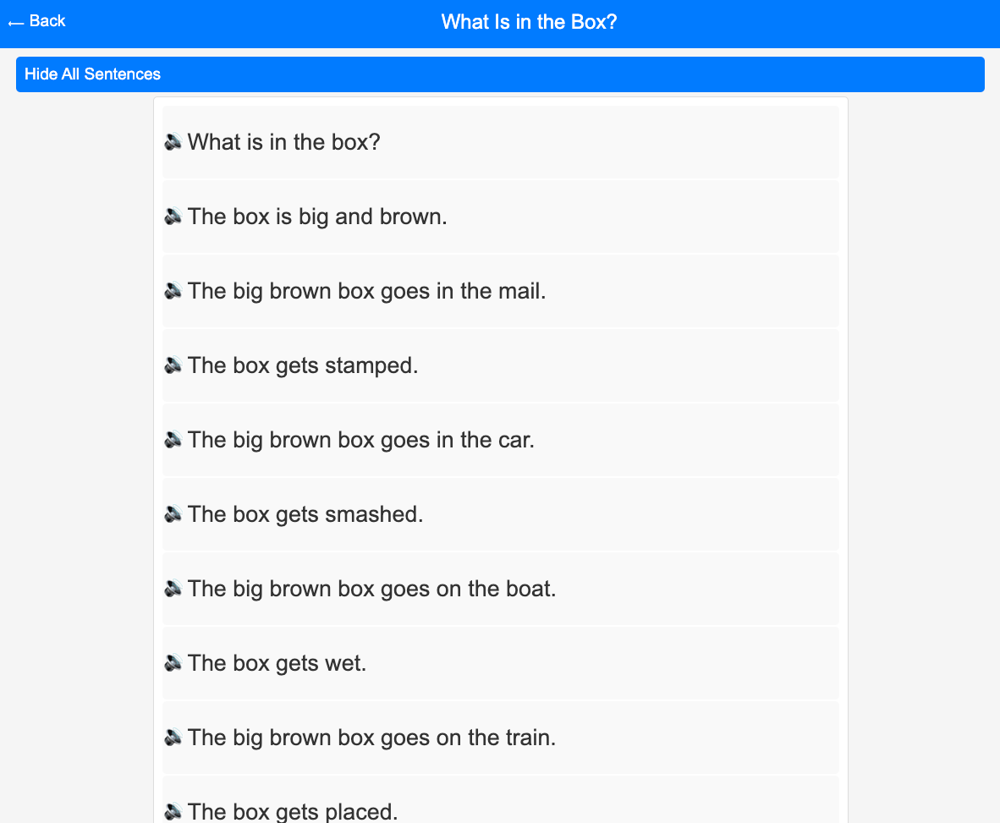
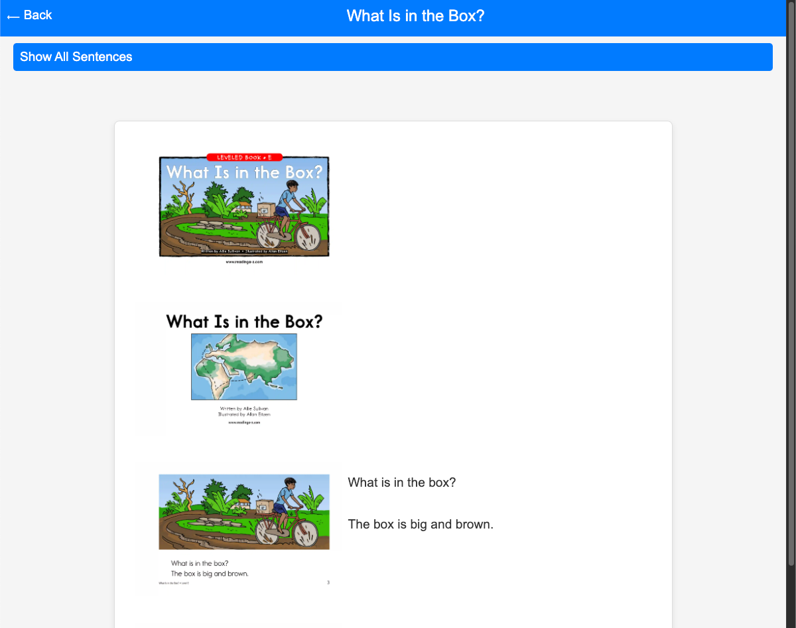

# WaDu
Wadu - 娃读，是一个将pdf转成有声阅读页面的web应用

## 背景
事情的起因是我家娃的老师会给一些英语pdf让我们陪娃一起读，我们打工狗也没那么多时间，另外自己的发音有时候也不准确，所以想做这样一个的应用，让娃自己读，同时也能听到相对标准的发音。
功能比较简单，代码写的比仓促，欢迎大家一起来完善，哈哈

## 功能展示

图书列表  


上传页面  


音频阅读  


图书页面  


## 技术实现
### 技术栈
- 前后端 Golang & HTML/CSS/JS
- pdf转图片
- OpenAI图理解从图片提取书页文字,并拆成句子
- 火山TTS语音合成
### 技术细节
先将上传pdf转成一张一张的图片，然后把每张给大模型进行图片理解，返回json结构，包括句子和页数等(会让大模型帮助断句)。后面就比较简单了，对句子进行TTS，保存图片和音频。前端页面展示图片和音频，点击音频播放。

## 运行
### 前置工作
1. 申请OpenAI账号，[获取API Key](https://platform.openai.com/api-keys)
2. 申请[火山云账号](https://console.volcengine.com/speech/app)开通语音合成服务，获取AppID和AppToken
3. 选择合成[音色](https://www.volcengine.com/docs/6561/97465)

### 配置
1. `cp .env.example .env`
2. 修改.env文件，填入OpenAI的API Key，火山云的获取AppID和AppToken以及音色

### 运行
```shell
git clone git@github.com:byebyebruce/wadu.git
cd wadu
go run .
```

## Docker
### 构建
```shell
docker build -t wadu .
```
### 运行
```shell
docker run -it -v $(pwd)/.env:/app/.env -v $(pwd)/data:/data -p 8081:8081 wadu
```

## 使用说明
### 说明
- 偷懒没有做鉴权系统，http://localhost:8081?admin 为管理员页面，可以上传pdf和删除书. http://localhost:8081 为普通用户页面

1. 打开浏览器访问 http://localhost:8081?admin
2. 点Upload
3. 上传pdf，点击生成，等待生成完成后检查下是否有错，没问题点击提交
4. 回到图书列表，点击图书名，进入图书页面

## 特殊用法
1. 修改视觉模型提取书页内容提示词
	1. 创建一个prompt.txt文件，内容为新的提示词
	2. 服务器启动加入参数 -prompt prompt.txt

当前提取书页内容的提示词是
```txt
你是读图书专家，你负责抽取图书的内容

我会给你书的一页图，你要返回以下字段:
title: 本页书的标题，没有就返回空字符串
sentences: 本页书的正文的每句话，没有就返回[]
page: 本页书的页码，没有就返回0

规则：
正文不包括图片中的文字、标题、页码、credit、作者、序章等
要将正文拆分成适合小朋友阅读的句子，单句不要太长(超过10个单词就是太长了)，也不要太短(只包含1~2个单词句子的根据上下文和前或后的句子合并)
如果是空白图片就返回{}

返回json格式
{
        "title": "标题",
        "sentences": ["句子1", "句子2"],
        "page": 0 
}
```
2. 命令行上传pdf
* 解决本地有openai环境，但是服务端没有的情况  
`./wadu upload --server=http://localhost:8081 xx.pdf `

## Q&A
1. 为什么要用OpenAI的图理解模型，不直接用OCR？  
OpenAI的图理解模型可以更好的理解图片，提取出图片中的文字，而OCR只能识别图片中的文字，对于一些复杂的图片，OpenAI的图理解模型更有优势  
2. `CGO_ENABLED=0 go build -o bin .` 编译的启动时会报错`panic: cannot load library: libmupdf.so: cannot open shared object file: No such file or directory`  
github.com/gen2brain/go-fitz使用了mupdf库

## TODO
- [ ] 支持Ollama等本地模型
- [ ] 支持更多语音合成服务
- [ ] 支持上传URL
- [ ] 支持上传时修正句子
- [ ] 书目录分页
- [x] Docker
